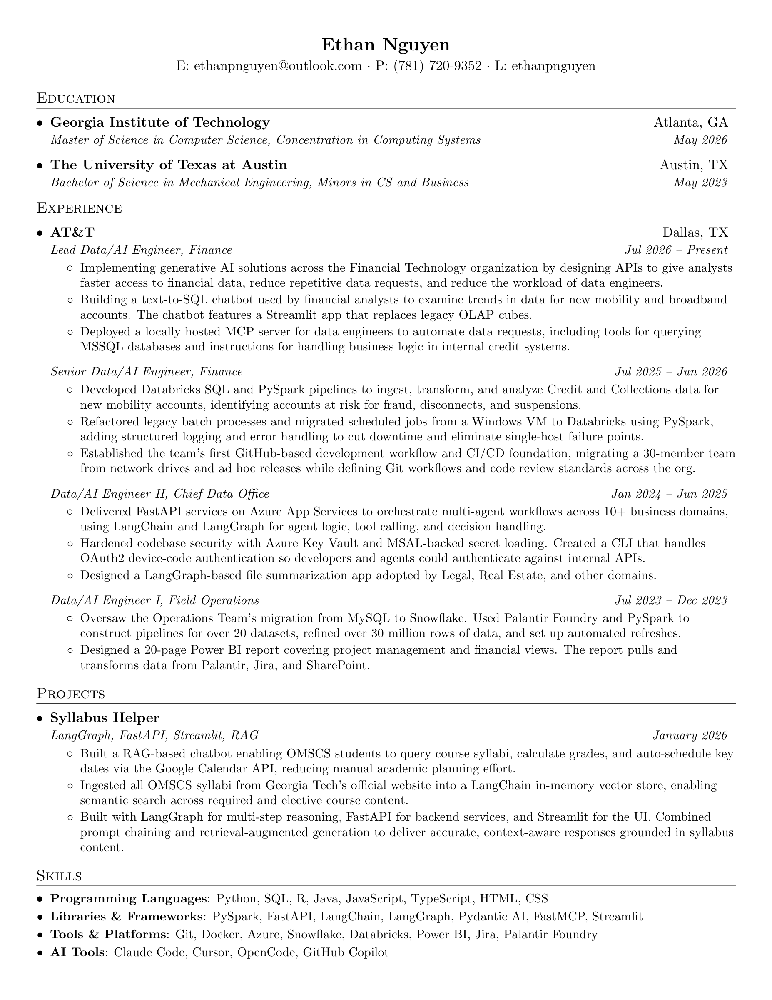

## Resume

[View the PDF](nguyen_ethan_resume.pdf)



### Build using Docker

```sh
docker build -t latex .
docker run --rm -i -v "$PWD":/data latex pdflatex nguyen_ethan_resume.tex
```

### Build using Latex

```sh
pdflatex -interaction=nonstopmode -halt-on-error nguyen_ethan_resume.tex
```

### Regenerate the PNG preview

```sh
rm -f preview/resume.png
qlmanage -t -s 2400 -o preview nguyen_ethan_resume.pdf >/dev/null 2>&1
mv preview/nguyen_ethan_resume.pdf.png preview/resume.png
```